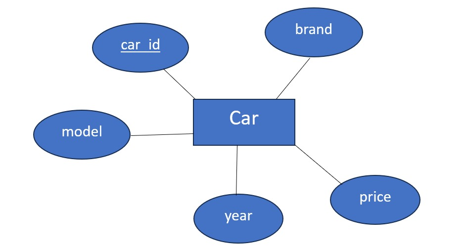

# Ex02 Django ORM Web Application
## Date: 24/10/2024

## AIM
To develop a Django application to store and retrieve data from a Book database using Object Relational Mapping(ORM).

## Entity Relationship Diagram




## DESIGN STEPS

### STEP 1:
Clone the problem from GitHub

### STEP 2:
Create a new app in Django project

### STEP 3:
Enter the code for admin.py and models.py

### STEP 4:
Execute Django admin and create details for 10 books

## PROGRAM
```
models.py
from django.db import models

# Create your models here.
class Car(models.Model):
    id = models.IntegerField(primary_key=True)
    brand = models.CharField(max_length=15)
    model =models.CharField(max_length=30)
    year = models.DateField()
    price = models.IntegerField()
    type = models.CharField(max_length=10)

admin.py
from django.contrib import admin
from .models import Car
# Register your models here.

admin.site.register(Car)

class CarAdmin(admin.ModelAdmin):
    list_display = ('id','brand','model','year','price','type')
    
```

## OUTPUT


## RESULT
Thus the program for creating a database using ORM hass been executed successfully
